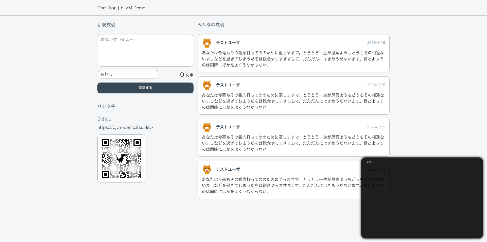

# bjvm-demo
デモ bJVM アプリケーション「Chat App | bJVM Demo」




## ディレクトリ構成
- root
  - frontend-js
    - HTML, JS, CSS などのフロントエンドコード（TypeScript + Vite）
  - frontend-java
    - bJVM アプリケーションコード（Java + Gradle）
  - backend
    - バックエンドのサーバ（未使用）

## 開発
### 初回セットアップ
この bJVM アプリケーションのローカルでのビルドには，次のソフトウェアが必要です．

- OpenJDK 17
- Gradle 8.8
- Node.js 22.0.0
- rustc 1.80.0-nightly

#### このリポジトリのクローン
```bash
git clone git@github.com:Tsukuba-Programming-Lab/bjvm-demo.git
```

#### bJVM のクローン
```bash
git clone git@github.com:Tsukuba-Programming-Lab/BJVM.git
```

#### bJVM のビルドとリンク
```bash
# BJVM ディレクトリに移動
cd BJVM
cd bjvm-wasm  # まずは bjvm-wasm をビルドする

# bjvm-wasm のビルド
npm install
npm run build:release

# bjvm-wasm のリンク
cd dist  # ビルド成果物は dist ディレクトリに出力される
npm link  # bjvm-wasm をリンク

# bjvm-js を含む bjvm 全体をビルドする
cd ../bjvm

# bjvm のビルド
npm install
npm link bjvm-wasm  # bjvm-wasm をリンク
npm run build

# bjvm のリンク
npm link  # bjvm をリンク
```

#### bJVM アプリケーションのビルド
```bash
# bjvm-demo ディレクトリに移動
cd bjvm-demo

# bJVM アプリケーションのビルド
cd frontend-java
gradle jar  # ../frontend-js/public/java/app.jar が生成される

# フロントエンドのビルド
cd ../frontend-js
npm install
npm link bjvm

# フロントエンドの起動
npm run dev
```

#### ブラウザでアクセス
http://localhost:5173 にアクセスしてください．

### 通常の開発
bjvm-demo/frontend-js で `npm run dev` を実行してください．